# Custom Reliable Data Transfer Protocol

## Description

A UDP file transfer protocol providing reliability, flow control and congestion control. Adapted the main components of TCP to recreate a connection-oriented and pipelined protocol for transmission between two hosts. Also provided interfaces to reliably transfer files from server to client.

Since we implemented multiple threads on the server side, and the Ack Listener thread shares the same local window with the Packet Sending thread, the Ack Listener thread keeps popping items out of the window, and the Packet Sending thread keeps pushing items into the windows. It is a producer-consumer synchronization problem. We used semaphore to solve this problem.

## Protocol Segment Structure

In our protocol, the header is placed in the first 16 bytes of the UDP payload, and the data comes right after with a maximum size of 1024 bytes. Therefore, the MSS (maximum segment size) is 1040 bytes. We adapted the header structure from the TCP protocol as shown below.


```
  0                   1                   2                   3
    0 1 2 3 4 5 6 7 8 9 0 1 2 3 4 5 6 7 8 9 0 1 2 3 4 5 6 7 8 9 0 1
   +-+-+-+-+-+-+-+-+-+-+-+-+-+-+-+-+-+-+-+-+-+-+-+-+-+-+-+-+-+-+-+-+
   |          Source Port          |       Destination Port        |
   +-+-+-+-+-+-+-+-+-+-+-+-+-+-+-+-+-+-+-+-+-+-+-+-+-+-+-+-+-+-+-+-+
   |                        Sequence Number                        |
   +-+-+-+-+-+-+-+-+-+-+-+-+-+-+-+-+-+-+-+-+-+-+-+-+-+-+-+-+-+-+-+-+
   |                    Acknowledgment Number                      |
   +-+-+-+-+-+-+-+-+-+-+-+-+-+-+-+-+-+-+-+-+-+-+-+-+-+-+-+-+-+-+-+-+
   |                               |A|S|F|                         |
   |            Window             |C|Y|I|        padding          |
   |                               |K|N|N|                         |
   +-+-+-+-+-+-+-+-+-+-+-+-+-+-+-+-+-+-+-+-+-+-+-+-+-+-+-+-+-+-+-+-+
   |                             data                              |
   +-+-+-+-+-+-+-+-+-+-+-+-+-+-+-+-+-+-+-+-+-+-+-+-+-+-+-+-+-+-+-+-+
```


## Using Our Protocol

Applications can use our protocol by using the command line interface (CLI) we provided. The connection is established as a client-server model, where the server sends out messages as a file and the client receives the messages and writes to a file.

The server can simply run 

`python3 server.py` 

The server will listen at port 6666 for any incoming request from a client and sends files in the path of “./serverStorage” upon client request.

The client can run the following command by replacing the arguments as identified with “&lt;>” with correct value:

`python3 client.py get <server ip> 6666 <file name>`

For example,


```
python3 client.py get 0.0.0.0 6666 test.html
```


The client will request for the specified file from the server and write it into a file with the same name at the current directory.

## Protocol Details


*   **Maximum Segment size**(MSS) = 1040 bytes
*   Initial **sequence number** is chosen at random
*   The **sequence numbers** are consecutive numbers that uniquely identify a segment sent
*   The **acknowledge number** is the next sequence number expected from the other host
*   **Selective repeat** pipelined protocol:
    *   The sender allows the receiver to acknowledge out-of-order segments selectively rather than just cumulatively acknowledging the correctly received segment
*   **Timeout** calculation
    *   sampleRTT is sampled by timing the duration between a segment sent and the segment’s acknowledgement received
    *   estimatedRTT = 0.875 * estimatedRTT + 0.125 * sampleRTT
    *   devRTT = 0.75 * devRTT + 0.25 * | sampleRTT - estimatedRTT |
    *   timeout = estimatedRTT + 4 * devRTT


## Three-way Handshaking


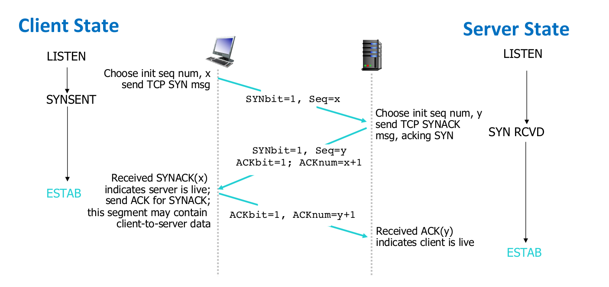


## Analysis


### Connection-orientation

We implemented connection orientation by adapting the TCP’s 3 way handshake and connection closure to ensure both hosts identify and allocate dedicated ports for a pipelined transmission. For example, the image below shows the server listening on port 6666 and the client running on port 9009.


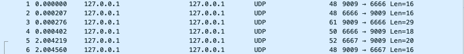


The procedure runs as follows (the images show the headers in hexadecimal):


1. client requests for connection with SYN bit set \
(hexadecimal of “40” is equivalent to binary number of “01000000”) \


2. server responds with SYN bit and ACK bit set  \
(hexadecimal of “c0” is equivalent to binary number of “11000000”) \


3. client confirms with ACK bit set and asks for a specific file \
(hexadecimal of “c0” is equivalent to binary number of “11000000”)


4. server responds with file found with a dedicated port for transmission \
(hexadecimal of “c0” is equivalent to binary number of “11000000”) \


5. server sends a packet on dedicated port \
(hexadecimal of “40” is equivalent to binary number of “01000000”) \


6. client confirms the port switch \
(hexadecimal of “c0” is equivalent to binary number of “10000000”) \


### Performance


We ran large samples of tests involving a variety of files using the “time” keyword in bash with a simulated network environment of bandwidth limited to 200Mb/s. It results in an average of 17.91 MB/s, which is good considering the limited bandwidth.

The following picture is a fragment of the test showing some of the files we used:


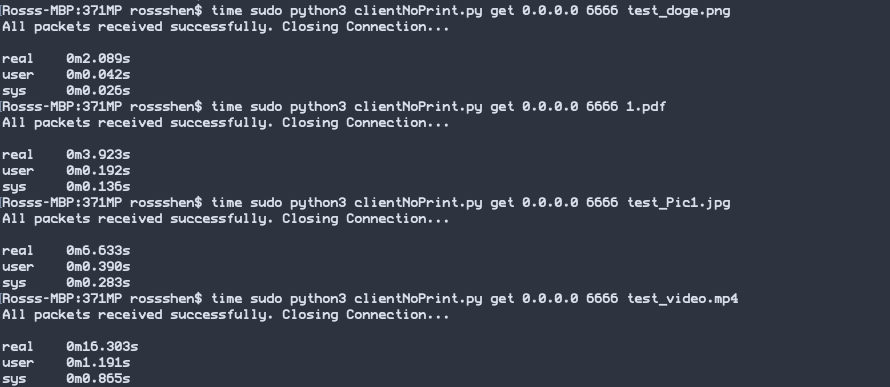


### Flow Control


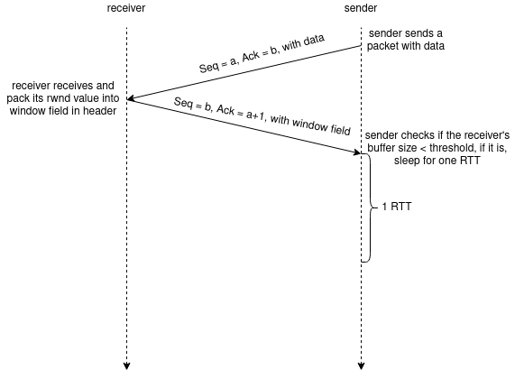


We implemented the flow control similar to TCP’s one. As illustrated in the above figure. The receiver will include its free buffer size(rwnd). On the sender side, the sender will set a threshold and check the rwnd in each received packet’s header. If the rwnd &lt; threshold, the sender will wait for 1 RTT time.

During the 1 RTT time, the Ack Listener thread will actively listen for incoming ACK packets from the receiver and update the rwnd value. After 1 RTT time, there will be 2 scenarios.


**<span style="text-decoration:underline;">The first scenario is:</span>**


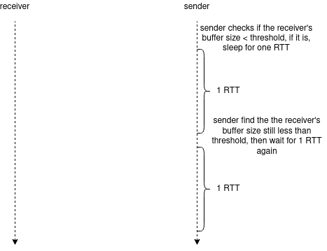


**<span style="text-decoration:underline;">The second scenario is:</span>**


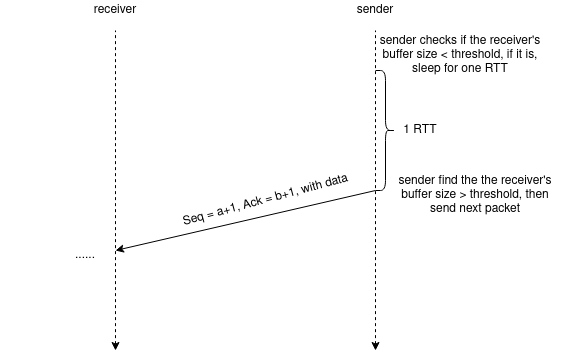


### Congestion Control

To avoid network traffic congestion, we implement congestion control mechanisms. Specifically, the sender keeps a local window size which contains all unAcked but sent packets. Before sending a new packet to the receiver, the sender will check if the local window is full, if so, it will wait until there is an empty spot.

The Ack Listener increments the windows size as show below:


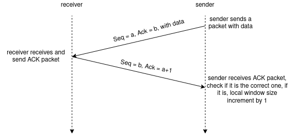


The sender keeps tracking the timer on the unAcked packet with the smallest sequence number, if timeout happens, the sender will retransmit that packet:


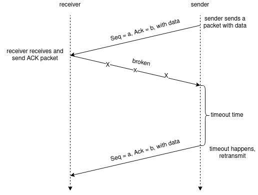


### 


### Protocol Fairness

Due to the implementation of congestion control applied in our protocol, the protocol should be considered fair. When the competing sessions use up all the available bandwidth, they will trigger congestion control and their sending window size will be cut in half. This reaction will result in the simultaneous sessions to have approximately the same sending rate, which reflects the same bandwidth usage.

By doing a little experiment, we can find that is the case. I performed the test under a macOs 11.2 environment and simulated the network by using the_ Traffic Shaper Control Program_ (“`dnctl`” command in bash) and the _Control the Packet Filter Device_ (“`pfctl`” command in bash). The bandwidth is limited to 1.0 Mbit/s and the tested file is 880.64 KB. \


This image shows the time for running one session:


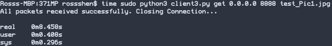


These images show the time for running two sessions simultaneously:


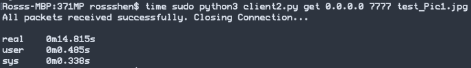


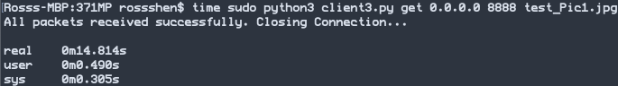


As we can see from the images, the test running with two sessions simultaneously ended together and is approximately 2 times slower than the test running only one session. This shows that the sessions are competing with each other for bandwidth and received the same amount of transmission rate. 


## Protocol Example Usage

In this example, the client will request this dog.jpg file, since the experiment is conducted under a linux environment, we used the linux Traffic Control tool to simulate a 250msec and 3% loss environment on localhost.


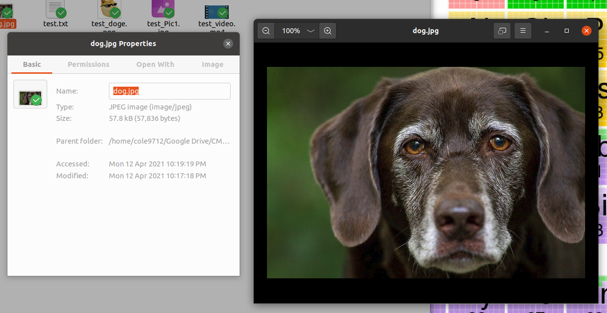


<span style="text-decoration:underline;">Client:</span>


```
cole9712@cole-ubuntu ~/G/C/371MP (main) >
sudo python3 client.py get 0.0.0.0 6666 dog.jpg
Received File Path is dog.jpg
HandShaking succeed! Request for file:dog.jpg
Starting tranferring file...
Local receiving server established, listening on 9009
Received segment with seqNum 8580
Start to receive file: dog.jpg with size 0.055156707763671875 MB from ('127.0.0.1', 6667)
Received segment with seqNum 8581
Writing packet No.1 into destination file
Received segment with seqNum 8582
Writing packet No.2 into destination file
Received segment with seqNum 8583
Writing packet No.3 into destination file
Received segment with seqNum 8584
Writing packet No.4 into destination file
Received segment with seqNum 8585
Writing packet No.5 into destination file
Received segment with seqNum 8586
Writing packet No.6 into destination file
Received segment with seqNum 8587
Writing packet No.7 into destination file
Received segment with seqNum 8588
Writing packet No.8 into destination file
Received segment with seqNum 8589
Writing packet No.9 into destination file
Received segment with seqNum 8590
Writing packet No.10 into destination file
Received segment with seqNum 8591
Writing packet No.11 into destination file
Received segment with seqNum 8592
Writing packet No.12 into destination file
Received segment with seqNum 8593
Writing packet No.13 into destination file
Received segment with seqNum 8594
Writing packet No.14 into destination file
Received segment with seqNum 8595
Writing packet No.15 into destination file
Received segment with seqNum 8596
Writing packet No.16 into destination file
Received segment with seqNum 8597
Writing packet No.17 into destination file
Received segment with seqNum 8598
Writing packet No.18 into destination file
Received segment with seqNum 8599
Writing packet No.19 into destination file
Received segment with seqNum 8600
Writing packet No.20 into destination file
Received segment with seqNum 8603
Received segment with seqNum 8604
Received segment with seqNum 8605
Received segment with seqNum 8606
Received segment with seqNum 8607
Received segment with seqNum 8608
Received segment with seqNum 8609
Received segment with seqNum 8610
Received segment with seqNum 8611
Received segment with seqNum 8612
Received segment with seqNum 8613
Received segment with seqNum 8614
Received segment with seqNum 8615
Received segment with seqNum 8601
Writing packet No.21 into destination file
Received segment with seqNum 8602
Writing packet No.22 into destination file
Writing packet No.23 into destination file
Writing packet No.24 into destination file
Writing packet No.25 into destination file
Writing packet No.26 into destination file
Writing packet No.27 into destination file
Writing packet No.28 into destination file
Writing packet No.29 into destination file
Writing packet No.30 into destination file
Writing packet No.31 into destination file
Writing packet No.32 into destination file
Writing packet No.33 into destination file
Writing packet No.34 into destination file
Writing packet No.35 into destination file
Received segment with seqNum 8616
Writing packet No.36 into destination file
Received segment with seqNum 8617
Writing packet No.37 into destination file
Received segment with seqNum 8618
Writing packet No.38 into destination file
Received segment with seqNum 8619
Writing packet No.39 into destination file
Received segment with seqNum 8621
Received segment with seqNum 8622
Received segment with seqNum 8602
Sent old ACK with ackNum 8603
Received segment with seqNum 8620
Writing packet No.40 into destination file
Writing packet No.41 into destination file
Writing packet No.42 into destination file
Received segment with seqNum 8620
Sent old ACK with ackNum 8621
Received segment with seqNum 8621
Sent old ACK with ackNum 8622
Received segment with seqNum 8623
Writing packet No.43 into destination file
Received segment with seqNum 8623
Sent old ACK with ackNum 8624
Received segment with seqNum 8624
Writing packet No.44 into destination file
Received segment with seqNum 8625
Writing packet No.45 into destination file
Received segment with seqNum 8626
Writing packet No.46 into destination file
Received segment with seqNum 8627
Writing packet No.47 into destination file
Received segment with seqNum 8628
Writing packet No.48 into destination file
Received segment with seqNum 8629
Writing packet No.49 into destination file
Received segment with seqNum 8630
Writing packet No.50 into destination file
Received segment with seqNum 8631
Writing packet No.51 into destination file
Received segment with seqNum 8632
Writing packet No.52 into destination file
Received segment with seqNum 8633
Writing packet No.53 into destination file
Received segment with seqNum 8634
Writing packet No.54 into destination file
Received segment with seqNum 8635
Writing packet No.55 into destination file
Received segment with seqNum 8636
Writing packet No.56 into destination file
Received segment with seqNum 8637
Writing packet No.57 into destination file
Received segment with seqNum 8638
All packets received successfully. Closing Connection...
```


<span style="text-decoration:underline;">Sever:</span>


```
cole9712@cole-ubuntu ~/G/C/371MP (main)> sudo python3 server.py
Listening on 6666
Establishing connection with ('127.0.0.1', 9009)
Acknowledgement sent to ('127.0.0.1', 9009)
file found :)
Initial packet with file size sent
seqN = 3 ackN = 8581 ack = 1
mySeqN8581
File size acknowledged
Start sending file...
Starting threads...
congestion control involved
Segment ACKed with sequence number: 8581
poped seq No.8581
Segment ACKed with sequence number: 8582
poped seq No.8582
congestion control involved
Segment ACKed with sequence number: 8583
poped seq No.8583
Segment ACKed with sequence number: 8584
poped seq No.8584
Segment ACKed with sequence number: 8585
poped seq No.8585
Segment ACKed with sequence number: 8586
poped seq No.8586
Segment ACKed with sequence number: 8587
poped seq No.8587
Segment ACKed with sequence number: 8588
poped seq No.8588
Segment ACKed with sequence number: 8589
poped seq No.8589
Segment ACKed with sequence number: 8590
poped seq No.8590
Segment ACKed with sequence number: 8591
poped seq No.8591
Segment ACKed with sequence number: 8592
poped seq No.8592
Segment ACKed with sequence number: 8593
poped seq No.8593
Segment ACKed with sequence number: 8594
poped seq No.8594
Segment ACKed with sequence number: 8595
poped seq No.8595
Segment ACKed with sequence number: 8596
poped seq No.8596
Segment ACKed with sequence number: 8597
poped seq No.8597
Segment ACKed with sequence number: 8598
poped seq No.8598
Segment ACKed with sequence number: 8599
poped seq No.8599
congestion control involved
Segment ACKed with sequence number: 8600
poped seq No.8600
TIMEOUT with 0.7332222818092362
Lost segment sent with sequence number: (8601,)
Segment ACKed with sequence number: 8601
poped seq No.8601
remote buffer size about to overflow, flow control involved, remote buffer free size=3072
remote buffer size about to overflow, flow control involved, remote buffer free size=3072
remote buffer size about to overflow, flow control involved, remote buffer free size=3072
remote buffer size about to overflow, flow control involved, remote buffer free size=3072
TIMEOUT with 0.6515407900823571
Lost segment sent with sequence number: (8602,)
Segment ACKed with sequence number: 8603
poped seq No.8603
Segment ACKed with sequence number: 8604
poped seq No.8604
Segment ACKed with sequence number: 8605
poped seq No.8605
Segment ACKed with sequence number: 8606
poped seq No.8606
Segment ACKed with sequence number: 8607
poped seq No.8607
Segment ACKed with sequence number: 8608
poped seq No.8608
Segment ACKed with sequence number: 8609
poped seq No.8609
Segment ACKed with sequence number: 8610
poped seq No.8610
Segment ACKed with sequence number: 8611
poped seq No.8611
Segment ACKed with sequence number: 8612
poped seq No.8612
Segment ACKed with sequence number: 8613
poped seq No.8613
Segment ACKed with sequence number: 8614
poped seq No.8614
Segment ACKed with sequence number: 8615
poped seq No.8615
congestion control involved
Segment ACKed with sequence number: 8616
poped seq No.8616
Segment ACKed with sequence number: 8617
poped seq No.8617
Segment ACKed with sequence number: 8618
poped seq No.8618
congestion control involved
Segment ACKed with sequence number: 8619
poped seq No.8619
congestion control involved
congestion control involved
TIMEOUT with 2.4290671327076696
Lost segment sent with sequence number: (8602,)
Segment ACKed with sequence number: 8602
poped seq No.8602
congestion control involved
TIMEOUT with 2.5234421682975943
Lost segment sent with sequence number: (8620,)
Segment ACKed with sequence number: 8622
poped seq No.8622
congestion control involved
congestion control involved
congestion control involved
congestion control involved
congestion control involved
TIMEOUT with 4.034692969909166
Lost segment sent with sequence number: (8620,)
Segment ACKed with sequence number: 8620
poped seq No.8620
congestion control involved
TIMEOUT with 3.888771072634317
Lost segment sent with sequence number: (8621,)
Segment ACKed with sequence number: 8621
poped seq No.8621
TIMEOUT with 3.6713858937478765
Lost segment sent with sequence number: (8623,)
Segment ACKed with sequence number: 8623
poped seq No.8623
congestion control involved
Segment ACKed with sequence number: 8623
Segment ACKed with sequence number: 8624
poped seq No.8624
congestion control involved
Segment ACKed with sequence number: 8625
poped seq No.8625
Segment ACKed with sequence number: 8626
poped seq No.8626
congestion control involved
Segment ACKed with sequence number: 8627
poped seq No.8627
Segment ACKed with sequence number: 8628
poped seq No.8628
Segment ACKed with sequence number: 8629
poped seq No.8629
Segment ACKed with sequence number: 8630
poped seq No.8630
b'\x1a\x0b#1\x00\x00!\xbd\x00\x00\x00\x12!\x84\x00\x00'
Segment ACKed with sequence number: 8631
poped seq No.8631
Segment ACKed with sequence number: 8632
poped seq No.8632
Segment ACKed with sequence number: 8633
poped seq No.8633
Segment ACKed with sequence number: 8634
poped seq No.8634
Segment ACKed with sequence number: 8635
poped seq No.8635
Segment ACKed with sequence number: 8636
poped seq No.8636
Segment ACKed with sequence number: 8637
poped seq No.8637
lost thread closed
Threads finished
b'\x1a\x0b#1\x00\x00!\xbd\x00\x00\x00\x12!\x84\x00\x00'
All segment transmitted!
```

