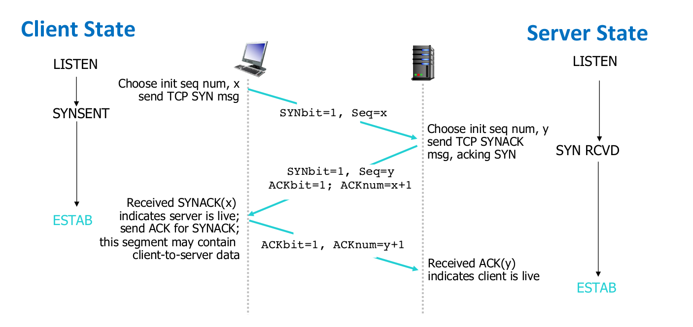

# Custom Reliale Transport Protocol

> CMPT 371 - Project
> Spring 2021
> Auther: Hao Wu, Ross Shen

## Description

## Protocol Design

### Segment Structure

```
   0                   1                   2                   3
    0 1 2 3 4 5 6 7 8 9 0 1 2 3 4 5 6 7 8 9 0 1 2 3 4 5 6 7 8 9 0 1
   +-+-+-+-+-+-+-+-+-+-+-+-+-+-+-+-+-+-+-+-+-+-+-+-+-+-+-+-+-+-+-+-+
   |          Source Port          |       Destination Port        |
   +-+-+-+-+-+-+-+-+-+-+-+-+-+-+-+-+-+-+-+-+-+-+-+-+-+-+-+-+-+-+-+-+
   |                        Sequence Number                        |
   +-+-+-+-+-+-+-+-+-+-+-+-+-+-+-+-+-+-+-+-+-+-+-+-+-+-+-+-+-+-+-+-+
   |                    Acknowledgment Number                      |
   +-+-+-+-+-+-+-+-+-+-+-+-+-+-+-+-+-+-+-+-+-+-+-+-+-+-+-+-+-+-+-+-+
   |                               |A|S|F|                         |
   |            Window             |C|Y|I|        padding          |
   |                               |K|N|N|                         |
   +-+-+-+-+-+-+-+-+-+-+-+-+-+-+-+-+-+-+-+-+-+-+-+-+-+-+-+-+-+-+-+-+
   |                             data                              |
   +-+-+-+-+-+-+-+-+-+-+-+-+-+-+-+-+-+-+-+-+-+-+-+-+-+-+-+-+-+-+-+-+
```

   Header format for python struct "!HHIIHBx"
   Total Segment Size = 16 bytes (Header) + 1024 bytes (Payload)

### Three-way Handshaking



### Connection Management


## Plan

- sender prepares and sends packet
- reciever recieves packet, unpack and log the data

## Usage

- two ways for invoke client
